# 第一部分 第一讲 信息系统工程概述

- 企业信息化
    - 企业信息化是应用信息技术，通过科学的 方法利用、配置和优化企业内外部资源， 使企业的运作管理规范化、科学化和系统 化的过程，从而达到提高效率、降低成本、 提升客户满意度的目的
    - 实质
        - 管理观念变革
        - 业务流程变革
        - 工作方式转变
        - 在创新的过程
    - 企业信息化
        - ERP(Enterprise Resource Planning)
        - CRM(Customer Relationship Management) 
        - SCM(Supply Chain Management) 
        - PDM(Product Data  Management) 
        - CAD(Computer Aided Design) 
        - BI(Business Intelligence)
        - CAPP(Computer Aided Process Planning)
        - CAM(Computer Aided Manufacturing)
        - 电子商务(e-Business)
- 信息系统（开发利用）面临的挑战
    - 第一类：彻底、全方位实施
    - 第二类：不断升级换代
    - 第三类：根据需求逐步分散实施
    - 第四类：不同部门或企业间信息交互与共享 
    - Summary:
        - 信息孤岛：数据分散定义、分散存储、使用
        - 烟筒式应用系统
        - 重复建设 重复开发
        - 资源浪费
        - IT 引入的企业风险增高
        - IT 管理混乱
        - IT 的持续发展缺少系统的理论和方法论
- 信息工程方法论（之后的概括）
    - 信息系统顶层设计
        - 特征
            - 顶层决定性
            - 整体关联性
            - 实际可操作性、
        - 全过程
            - 需求开发
            - 体系结构设计
            - 信息资源规划
            - 技术体制论证
            - 顶层设计验证
    - 信息工程与总体数据规划
        - James Martin 信息工程方法论 IEM
            - 信息系统以数据为中心
            - 数据是稳定的，处理是多变的
            - 用户要参与到开发工作中
        - 信息工程内容
            - 强调总体数据规划
            - 主要内容
                - 信息工程的原理、方法、工具
                - 总体数据规划的组织
                - 企业模型
                - 主题数据库
                - 实体活动分析
                - 数据分布规划
                - 规划与开发建议
- 信息资源管理与基础标准
    - 霍顿 IRM 理论
        - 企业的信息资源与其它资源有同等地位， IRM是一种新的管理职能； 
        - 必须将IRM与企业的战略规划联系起来，把 信息资源作为战略资产进行管理，在企业的 每个层面上识别信息资源和获利机会，并借 以构建新的竞争优势； 
        - 企业IRM的目标是“3E”: Efficient（高效）、 Effective（实效）、Economical（经济）。
    - 威廉德雷尔：数据管理理论与实践
        - 没有卓有成效的数据管理，就没有成功高效的数据处 理，更建立不起来整个企业的计算机信息系统； - 数据元素是最小的信息单元，数据管理工作必须从数 据元素标准化做起
        - 企业数据管理部门的重要职责，是集中控制和管理数 据定义，建立全企业数据管理基础标准和规范化的数 据结构，协调计算机应用开发人员和用户实施数据管 理标准规范
        - 数据管理是企业管理的重要组成部分，是长期复杂的 工作，会遇到许多困难，持之以恒才能见到效果
    - 特色
        - 数据管理基础标准
    - 数据管理基础标准
        - 数据元标准
        - 信息分类编码标准
        - 用户视图标准
        - 概念数据库标准
        - 逻辑数据库标准
- 信息资源规划的工程化方法
    - BPR -> IRP -> ERP
    - 

# 第二部分 第二讲 信息系统分类描述

## 物流业信息化及信息系统 - 库存管理技术与系统

- 库存管理的概念
    - 库存就是具有经济价值的任何物品的停滞与储 藏，是供将来使用的所有闲置资源
    - 库存管理
        - 仓储管理
        - 库存控制
- 库存控制技术
    - 库存周转率 ITO 
        - 衡量材料流动快慢
        - 销售的物料成本 / 平均库存
    - 库存计划模型
        - 核心思想
            - 一个中心
                - 服务 & 成本
            - 两个基本点
                - 啥时订货
                - 订多少货
            - 定货点法

                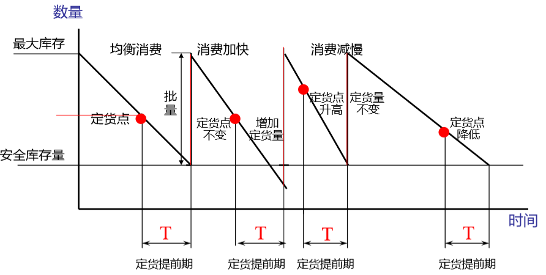

        - 影响库存水平的主要因素
            - 周期库存
                - 订货或补货周期内的库存需求 
            - 安全库存
                - 防止断货而准备的最低的库存
        - 库存计划四个关键模型
            - 经济订货批量 EOQ

                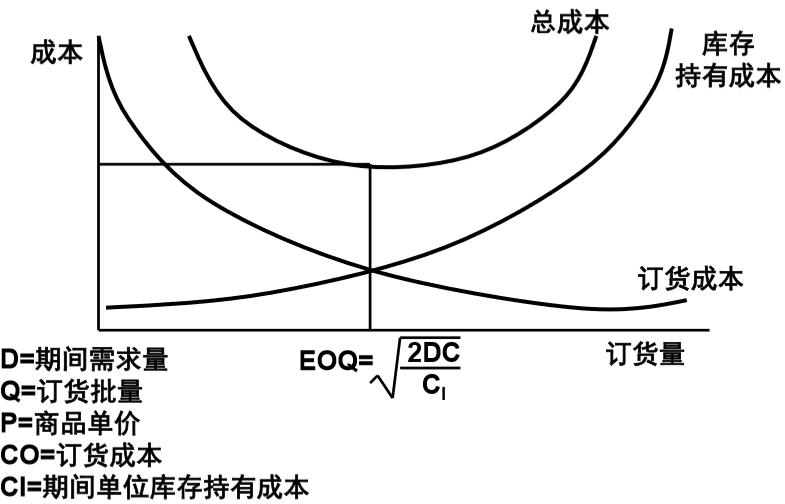
                - P: 商品单价
                - D: 期间需求量
                - C_o: 订货成本（每次订货的成本，与）
                - Q: 订货量
                - C_i: 持有成本
                - TotalCost(Q) =  P * D + C_o * D / Q + P * C_i * Q / 2 (线性减少所以除以2)
                - dTC / dQ = - C_o * D / Q^2 + P * C_i / 2 = 0
                - 求得 EOQ = (2 * D * C_o / C_i)^0.5
            - 基本术语
                - ROP 再订货点
                - LT 前置时间
                - Q 订货量
                - D 需求量
                - s: 再订货点
                - S: 订足目标
                - R: 计划间隔时间

                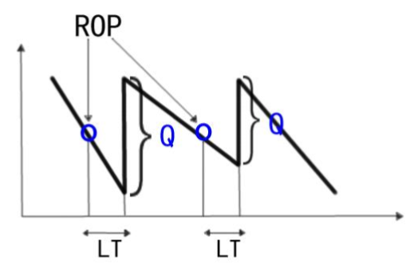

            - 再订货点 (s, Q) 模型
                - Q: constant
                - 库存降低到安全库存 s 时，补充固定的订货量 Q
            - 固定周期模型 (R,S)
                - 时间点 ROP 固定，但每个时间点的间隔 R 可以不固定
                - 补充的目标 S 固定
                - 每到 ROP， 就补充到 S
                - S: constant
            - (s, S) 模型
                - 库存降低到安全库存 s 时，补充到 S
            - (R, s, S) 模型
                - 每隔时间 R 就观测，如果库存小于等于安全库存 s 就补充到 S
        - 订货批量 Lot Sizing 计算的五种经典方法
            - 简单算法
                - 固定期间需求 - FPD 
                    - 每隔 n 周，将之后 n 周的需求量的货物定好
                    - 问题：你咋知道要定多少
                - 经济订货批量 - EOQ
                    - EOQ = (2*D*C_o/C_i)^0.5

## 制造业信息化及信息系统

- 概述
    - CIMS - Computer   Integrated Manufacturing System
    - CIM 不等于全盘自动化，计算机只是工具、手段， 系统集成包括人的集成
        - 组成
            - 管理信息系统
                - MRPII
            - 工程设计自动化系统
                - CAD、CAPP、CAM
            - 制造自动化系统
            - 质量保证系统
            - 计算机通信网络
            - 数据库系统
        - MRP / MRP II / ERP / SCM
        - CAD、CAPP、CAM

- MRP/MRPII/ERP/SCM
- CAD/CAPP/CAM

# 第三部分 第三讲 信息系统开发例说

## 1. 基于实践，编写开发计划

### 典型信息系统
- 站在欠缺经验的开发者角度考虑
    - 规划系统、建立计划、Use Case、ER、DFD 一直到系统实现，逐步勾画
    - 之后再改进，到系统化、软件工程化层面讨论

### 如何编制好的计划
1. 这是什么项目
2. 如何分解系统
3. 如何安排好项目进度、人员、资金
4. 如何考虑知识产权问题

- 基于实践
    - 脚踏实地，规范明确的文档

### 这是什么项目

以酒店为例

- 了解酒店背景
    - Negative - 脱离实际、空泛虚无
    - Positive - 各种数据实体
        - e.g. 
            - 部门、员工、客房分类及数量、楼层层数、客房分布
- 系统目标
    - Negative - 脱离实际、空泛虚无
        - e.g.
            - “优秀的”、“先进的”、“稳定的”
            - “等功能”、“等特点”
    - Positive - 具体功能
        - e.g.
            - 预定、接待、退房、账单
- 酒店组织架构图
    - 图标规范
    - 展开均衡
    - 颜色合适
    - 辅以表格、文字等
- 业务流程
    - 流程图中，除了业务本身，最好包括相应人/数据对象
    - 适当忽略细节功能
- 系统硬件网络环境
    - 全局性布局，抓住重点
    - 与业务相关的部分

### 如何分解系统

- 把系统分成几个子系统
    - 粒度应均衡
    - <b>有时甚至需要业务过程再造</b>
        - 引入信息系统后业务流程可能改变
        - <b>让业务适应信息系统，而不是信息系统适应落后的业务</b>
- 明确子系统功能
    - 详细定义、说明
- 确定软硬件配置
    - 多方协商。不仅仅是软件工程师
    - 预算

### 如何安排好项目计划

- 时间：软件过程模型
    - 根据实际选用
    - 传统 瀑布模型、旋转模型、原型模型等
        - 大型项目应采用瀑布模型，做好需求分析、系统建模、软件设计，而不着急编码
    - 现代 XP模型、SCRUM模型
        - 规模较小，快速开发
    - 实际项目开发中中，可以在分析阶段使用原型设计开发，明确系统需求；编程阶段，结合使用 xp，成对编程等方式，保证质量；测试维护阶段，不断根据用户反馈，螺旋式更新改进
    - Main Idea
        - 使用专业软件工具制作进度计划表
            - 信息工程主要思想方法： <b>利用工具，将方法至于工具之中，用工具帮助和控制人的工作</b>
        - 使用表格而不是文字
        - 时间使用周为单位‘
        - 根据每个项目具体情况，设计、描述进度计划
- 资金：为测试、维护留有余地，-40-20-40原则
    - 工作量分配：前期 40%，中期 20%，后期 40%
    - 后期工作量、难度相当大
        - 测试、运维等
    - 根据时间、人员、工作内容计划，给出有说服力的资金预算
- 人员：人件与风险管理
    - 针对软件人员
        - 舒适的环境
            - 进取的气氛、开心的心境、创造的欲望
        - 风险意识
            - Deadline 控制
                - 微软等采用区间式 Deadline
    - 有备无患（防止人员流动等）
        - 重要岗位后备
            - 程序员 测试员 交换；项目经理配备助手
        - 规范文档记录

### 如何考虑知识产权问题
- 不仅仅是正版盗版软件问题
- 甲方责任与义务
- 乙方延期的处罚
- 谁拥有该系统
    - 规定好比如：甲方 30%，乙方 70%；使用权；违规赔偿等
    - <b>不因合同双方发生收购、兼并、重组、分立而发生变化</b>

### 如何编号系统开发计划书
- 整洁明确的封面，涉及的系统与内容、文档版本、作者、小组成员、单位、联系方式、编制日期
- 文档版本记录表，记录版本变化历史
- 文档控制页
    - 多方签字认可
- 图表、缩写语索引

## 2. 观察实践，分析需求

大型系统开发需要瀑布型过程模型，工程化方法和管理

### 需求分析
1. 宏观上把握系统
    - 把握系统要做什么
        - 功能图
        - 系统Use Case
2. 微观上确立概念
    - 建立系统概念模型
        - E-R图
        - 类图
        - 数据字典
3. 流程上明确需求
    - 勾画数据流、控制流、对象之间的相互关系
        - DFD图
        - 对象交互图
        - IPO图

### 从宏观把握系统 - Use Case

- 适用于宏观场景描述，表达角色与软件之间的交互关系，不适合描述程序流程。
- 从用户角度观察系统需求，不适合表述系统分解模型

1. 前后绘图的业务、功能的完整性应保持一致
2. 概念名称应保持一致
    - e.g. 餐娱消费
3. 动词+名词 详细描述业务，而不是仅仅一个名词
    - e.g. 查询 -> 查询账单
- 软件工程开发思考原则：<b>前后一贯，左顾右盼</b>
4. 不应该引入 登录 等控制流、软件过程
5. 相同工具绘制

### 从微观明确概念 - 系统概念模型
- 考虑、定义每一个概念与数据
- 根据概念模型到处对象类、数据库表
1. ER图
    - 有哪些概念、它们相互之间的关系
    1. 同一个 ER图中，粒度应保持一致
        - 部门 ER图中就只出现部门，不需要出现 客人等细粒度概念实体
    2. 前后一贯，左顾右盼
2. 概念定义 - 数据表
    - 每个概念包含哪些数据
    - 数据的具体定义
    1. 前后一贯
        - 客人 客户；客房 房间
    2. 完整性 不能遗漏
    3. 每个数据项都要展开、定义
3. 概念定义 - 数据字典
    - 类型
    - 前后一致
    1. 所有概念、数据定义汇总在字典后，并排序
        - 按英文名称
        - 按中文名称
        - 按编号

### 从流程明确需求 - DFD IPO
DFD 数据流动视角，动态模型；ER 静态模型
- 数据层面，不能代表控制流
- 软件系统以控制流控制的代码来实现数据流的处理
1. DFD
    - DFD 需要自顶向下不断细化，底层数据流可以很细
    - 箭头表示数据流，应该用名词命名
2. IPO
    - Input -> Process -> Output
    - 根据此来设计测试用例

## 3. 深入实践，建立 UML 模型
- 多视角分析
    - E-R，DFD等分析系统需求
    - 面向对象

### 面向对象
- 把软件要处理的客观世界中的物件提炼出来
- 多态、封装、继承

### 哪些是本系统的对象 - 静态 Class 图
- E-R 图是很好的参照
    - 实体基本上对应对象
    - 实体间的关系基本上就是对象类之间的关系

#### 系统 Class 图
- 聚合组成
- 继承
    - 子类若无独立属性、行为，则没有必要存在
- 关联

#### 系统 GUI 类图
- 设计基本上要与 Use Case 和子系统功能分布对应
- 左顾右盼，前后一致

## 如何用对象实现系统 - 动态 Sequence 图

描述相应行为属于哪个对象、对象与行为之间如何交互

- 如果序列图中，某个对象没有被使用过，说明是不需要的
- 泳道上出现的操作一定属于这个对象
- <b>一张序列图描述一个 Use Case</b>

### 如何编好系统需求规范说明书 - SRS

前面形成的开发计划书是SRS重要前导文件， SRS 必须 根据计划书中的基本要求和宏观架构进一步细化分析数据 模型、面向对象模型

- 计划书与SRS保持一致

## 4. 围绕实践，设计系统架构与部件

### 4.1 如何考虑系统架构
每个架构之间不一定矛盾

- 以数据为中心的体系架构
    - 信息管理系统基本都是这个
- 分层体系架构
- 三层体系架构
- 调用/返回体系架构 
- 面向对象体系架构：总线式体系架构 

#### 4.1.1 以数据为中心的体系架构
- 以数据为中心的体系架构主要针对以数据库为基础的软件系统
    - 大量数据的保存、检索是系统的基本要求

#### 4.1.2 分层体系架构
- 分层体系架构是从软件之间的相互依赖关系出发来观察、 描述软件之间的架构
    - 如一般软件系统的核心是操作系统 ，然后是数据库等支撑系统，外层是各种语言的应用软件 系统。

#### 4.1.3 三层体系(C/S, B/S)架构
- 基于网络的发展，现在的软件都需要在网络上运行，因此又时常以三层体系架构的形式出现 如 Client/Server. Browser/Server 架构 

#### 4.1.4 调用/返回体系架构
- 调用/返回( Call and Return )体系是传统的面向过程方 法对软件架构的基本认识，认为软件是由一个个过程(子 程序)组成的，软件的架构主要是主程序调用子程序、上 级程序调用下级程序、被调用程序将运行结果返回给调 用程序，这样所形成的一种层次休系 

#### 4.1.5 面向对象体系架构
- 实现对象交互的一种有效的 架构形式是通过对象请求代理( Object Request Broker )机制，仿佛在对象之间构筑一条消息“ 总线”， CORBA、 DCOM、 EJB 都是这种架构的体现
- 以 Web 后端为例，自己在做程序设计时思想还是面向过程，但是 Controller，Service 那一套分层体系实际上属于面向对象。Controller 实际就是 ORB 的总线式请求代理。

### 4.2 如何组织对象部件——Package 图

与软件工程导论相同

### 4.3 如何设计对象部件

包中的各个对象类，最终要通过部件设计去实现。部件( 或称组件)是实现对 象类的软件模块单位

一个对象类需要一个对应的实现部件， 一个 部件也可以包括几个相关的对象类 

- Class 类图
    - 面向对象
    - 只不过方法应该用伪代码或其他方式实现
    - 按照面向对象方法，预订登记、预订更改、预订删除都 是"预订"对象类中的操作，

- Activity 活动图
    - 面向过程
    - 完全用过程设计的思路来实现“预订”模块的所 有功能，包括预订登记、预订更改、预订删除，所以就有了 预订方式选择等分支
    -  以过程为单位组织软件模块，没有任何的对象复 用、封装等，当其他软件要利用其中的某些操作时，非 常不方便

- State 状态图
    - 主要描述某个对象或者系统内部，由于外 部事件和软件行为而引起的状态迁移 

- Swimlane 泳道图
    - 将对象交互与对象内部操作过程结合 在一起描述，既有对象交互的外部视角，也有对象操作过 程的内部视角

## 总结
本讲实例基本上是按照瀑布型模型组织过程和文档的，因此在每个阶段都全 面展开对每个子 系统的分析设计

如果开发过程和文档按照渐增方式或者螺旋方式组织实施，效果又会怎样? 

# 第三部分 第四讲 信息系统顶层设计

顶层设计是运用系统论的方法，从全局的角度，对某项任务或者某个 项目的各方面、各层次、各要素统筹规划，以集中有效资源，高效快 捷地实现目标 

- 概要
    - 特征
        - 顶层决定性
        - 整体关联性
        - 实际可操作性

    - 顶层设计技术分类解析
        - 需求开发
            - 通过规范的需求描述形式对需求开发的内容进行组织，使决策人员 、系统设计人员能迅速从描述中提取需求，便于系统开发团队内部 的沟通和需求追溯 
            - 过程
                - 需求获取
                - 需求描述
                - 需求分析
                - 需求验证需求
            - 文档形式
            - 三种主流需求描述方法
                - UML
                    - Use Case
                    - 静态图
                        - 类图
                            - 对象图
                        - 包图
                    - 行为图
                        - 状态图
                        - 活动图
                        - 时序图
                - IDEF
                - 视图
            - 四种需求分析方法
                - 基于场景的需求分析方法
                - 基于目标的需求分析方法
                - 基于威胁的需求分析方法
                - 基于能力的需求分析方法

        - 体系结构设计
            - 从总体上把握系统的结构，确定系统 与外界环境之间及系统内各组成部分之间的接口、通信和信息交换 关系，而不涉及系统设计的细节
            - 体系结构工具以计算机软件的方式，在体系结构建模方法 的基础上提供体系结构信息的标识和维护能力，通过可定 制的用户界面，向用户提供体系结构设计、描述和验证的 支撑功能，自动维护体系结构设计中的大量信息，减少设 计人员的工作量，提高体系结构开发效
            - 顶层设计的核心支撑技术，为顶层设计提供直接的设计手段和方法 

        - 信息资源规划 （******）
            - <b>James Martin 信息工程方法论</b> 强调总体数据规划
                - 信息系统以数据为中心
                - 数据结构稳定，处理多变
                - 用户必须参加开发工作
            - 规划需求分析主要用于分析系统的数据需求，而需求开 发技术关注功能及性能层面的需求

        - 技术体制论证
            - 分别从数据和技术两个方面提供细化设计的方法 
            - 技术体制概括并集中反映了信息系统的主要技术特征和 实现方式
            - 从技术的特性、关系、发展预测和应用方式等方面，对 信息系统的技术体制描述形式进行规范

        - 顶层设计验证
            - 为顶层设计的成果提供正确性、完备性和一致性等验证能力，为其它技术 提供支撑
            - 两方面
                - 需求验证技术
                    - 在需求阶段发现并改正一个错误，比在后续阶段发现再 改正错误，系统项目付出的代价要小得多
                - 体系结构验证技术
- 企业架构
企业架构从企业全局的角度将企业管理模式、企业业务流程、企业信息资 源、企业信息系统、企业信息化技术创造性的融为一体，系统考虑与企业 信息化相关的业务活动、数据环境、应用系统、技术设备以及它们之间的 相互作用关系，并与企业经营、战略目标相结合，指导企业信息化工作
    - 概念
        - Why needed?
            - Problem:
                - 信息化 成为若干 信息化项目 的总和，没有总体规划（顶层设计），业务部门之间无法协调合作
            - 因此需要企业架构来做顶层设计
        - EA(Enterprise Architecture) 内容
            -  生命周期角度
                - 架构愿景
                - 架构定义
                - 过度计划
                - 架构治理
            - 架构层次
                - 业务架构
                    - 描述了企业的业务策略、管理模式、组织结构和关键 业务流程。企业业务架构确定企业保持持续竞争优势 的业务设计，并通过企业信息架构和技术架构来实现 
                - 数据架构
                    - 描述了企业所拥有的数据和数据管理资源，通过企业 业务架构抽取企业的数据标准、数据元素、数据模型 ，构成数据库、数据仓库等企业数据运行环境，并与 联机事务处理(OLTP)、联机分析处理(OLAP)、联机 数据管理(OLMP)等手段相结合，为企业应用架构提 供统一的数据平台
                - 应用架构
                    - 描述了在企业统一的数据平台上各个相对独立的应用系统的部署 以及和核心业务流程之间的作用和关系。企业应用架构实现企业 各个业务流程的信息化和可行的自动化，并使得各个应用系统的 集成运行成为可能。
                - 技术架构
                    - 是实现企业应用架构的底层技术基础结构，通过软件平台技术、 硬件技术、网络技术、信息安全技术间的相互作用支撑企业应用 的运转。他通过提供满足各种角色的用户需要的技术平台将应用 架构、业务架构、和信息架构连在一起。
        - 主流企业架构框架和方法论
            - Zachman

                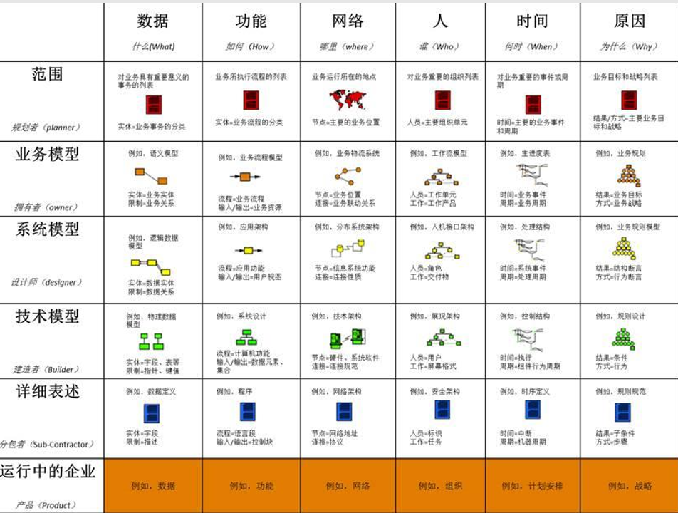
                - Zachman框架逻辑具有通用性和迭代性 
            - TOGAF
                -  TOGAF能力框架
                -  TOGAF架构开发方法和内容框架
                -  TOGAF企业连续体和工具
            - DoDAF
            - FEAF
        - 企业架构建模过程
            - 业务架构建模 
                - 明确系统范围  
                    - 绘制上下文图 明确系统与环境的主要接口
                        
                        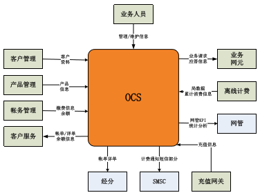
                        - 说明了业务的外部实体
                        - 与业务与外部实体之间的接口
                - 过程分解
                    - 将系统分解成 逻辑子系统或 业务过程，形 成过程分解图 。 至少要分解到 活动或用例级 （即可由一个 岗位独立完成 的任务）。 过程分解图可 作为过程文档 不做输出
                - 梳理事件列表
                    - 以事件列表形式描述事件 的触发器、响 应、来源、目 的等信息。 除事件列表外 ，还可绘制事 件自身的DFD 。 事件列表和事 件DFD是过程 文档，可不输 出
                    - 事件，来源，业务流程，触发，相应，目的地
                - DFD 建模
                    - 绘制 0、1、2、… 等级别的DFD图 ，并输出数据字 典。 数据字典以业务 过程列表和实体 列表表达

            - 数据架构建模 
                - 纵向
                    - 业务
                    - 管理
                    - 实现
                - 横向
                    - 概念
                        - 实体间关系
                    - 逻辑
                        - 实体到数据模型
                        - 范式化
                        - 完整性约束
                        - 完善实体属性
                    - 物理
                        - 考虑性能，进行反规范化设计
                        - 引入具体实现层面需要的实体和处理
            - 应用架构建模 
                - <b>UC 矩阵</b>（******************************）

                    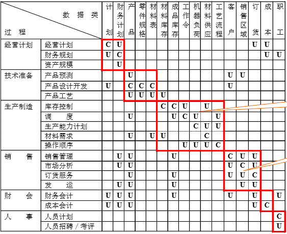
                    - 用来表达过程与数据两者之间 的关系
                    - 利用结果关系进行了子系统划分
                    - 正确性校验：
                        - 完备性校验：指对具体的数据项必须有一个产生者（C）和至少一个使用者（U），功能则必须有产生或使用（U或C） 发生 
                        - 一致性校验：指对具体的数据项必须有且仅有一个产生者（C） 
                        - 无冗余校验:指 U／C矩阵中不允许有空行和空列 
                    - 求解：
                        - 调整表中的行变量或列变量，使得“C”元素尽 量地朝对角线靠近，然后再以“C”元素为标准，划分子系统。
            - 技术架构设计
                - 参考模型 
                    - NGBSS
                        - 功能数据分离
                        - 功能规则分离
                        - 功能流程分离
                        - 界面功能分离
                    - NGOSS-TNA基于DIOA
                        - DIOA：面向组件的设计方法。通过接口提供服务
                        - 概念层次
                            - 框架服务组件
                            - 托管服务组件
                            - 业务服务组件
                        - 应用 ⊇ 组件 ⊇ 服务 
                    - TNA 架构定义
                        - 运算视角
                            - 定义了NGOSS组件
                            - 定义了组件间交互方式
                        - 工程视角
                            - 定义组件内部核心对象、接口对象、契约实例
                            - 核心对象间关系、契约对象间消息传输与操作调用和中间件及中间件协议
                    - DIOA
                        - 业务模型层
                            - 业务应用设计与实现。由组件实现
                        - 服务工程层
                            - 组件建模。包括接口、协议、规范
                        - 服务框架层
                            - 框架服务接口与对象的建模。命名服务、事件服务
                        - 基础技术层
                            - 中间件与基础技术建模
                    - TRM 层次分析
                        - 3个层次
                            - 应用软件层
                            - 应用平台层 - 应用组件框架
                            - 通讯基础框架
                        - 2类接口
                            - 应用软件与应用平台
                            - 应用平台与基础设施
                - 集成架构 
                    - 数据集成 ： 类似于 repository
                        - 批量数据传输，数据同步
                    - 应用集成 ： 类似于 service
                        - 系统间业务逻辑调用，符合规范
                    - 流程集成 ： 类似于 controller
                        - 把应用系统暴露出来的应用、数据接口进行流程定制
                    - 界面集成 ： 类似于 web frontend
                        - 访问界面计中计来
                    - 点到点
                        - 数据固定
                        - 只涉及两个系统
                        - 非实时接口，大量数据
                    - 平台集成
                        - 多系统
                        - 多次交互，自动控制流程
                - 技术架构
                    - Technology Neutral Architecture：基于组建、分布式、灵活业务流程部署、易于集成、与技术无关

                        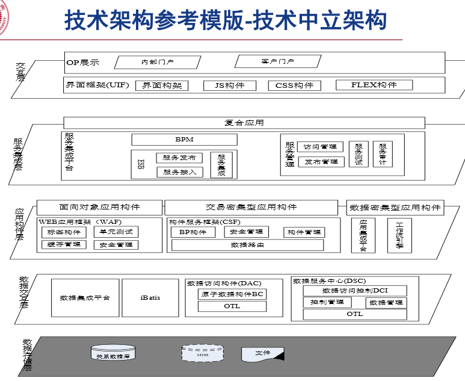

                    - Technology Specific Architecture: 在TNA基础上 将各层组件的实现技术进行规范

                        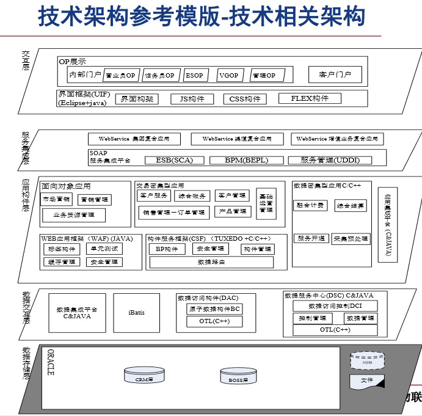

# 第三部分 第五讲 信息工程与总体数据规划

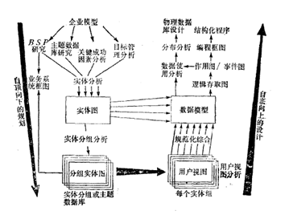

## 信息工程的原理、方法和工具

### 软件工程

软件危机 -> 软件工程

### 信息工程

数据处理危机 -> 信息工程

从需求分析开始的传统的生命周期 开发方法论，是否符合大型复杂信息系统的开发？ 

- 信息工程概念
    - John Collins：“信息工程作为一个学科要比软件工程更为广泛，它包括了为 建立基于当代数据库系统的计算机化企业所必需的所有相关的 学科。”
    - 三个基本点
        - 信息工程的基础是当代的数据库系统
        - 信息工程的目标是建立计算机化的企业管理系统
        - 信息工程的范围是广泛的，是多种技术、多种学科的综合

- 信息工程基本原理
    - James Martin 信息工程方法论 （********************）
        - 自顶向下的规划， 自底向上的设计
        - 基本前提
            - 数据位于现代数据处理的中心
            - 数据是稳定的，处理是多变的
                - 稳定的数据模型
                - 处理过程复杂多变
                - 灵活性
            - 用户必须真正参加开发工作
                - 从规划到设计实施
                - 用户和要积极开发系统
                - 数据处理部门要培训、联合用户开发
                - 采用用户友好的语言和一系列开发工具，提高自动化
        - 基本方法： 总体数据规划的四大部分
            - 企业模型开发
            - 实体活动分析
            - 主题数据库
            - 数据分布与规划
        - 完整方法论
            - 1. 企业模型开发
                - 企业模型是一张完整图表， 能表示出一个企业的职能和 活动。这张图表可能很大， 因为一个企业有几百个业务 活动，有的甚至有一千多个 业务活动。
                - 因此可以分成好几个图
            - 2.  借助实体关系分析（Relationship Analysis）建 立信息资源规划 
                - 自顶向下数据类型分析，数据之间如何联系的
                - 有时需要整个企业内分析，有时某部门内分析，……
            - 3. 数据模型的建立
                - 主题数据库规划方法
                    - 第一种方法
                        - 2 建立的实体模型，面广，但缺少细节
                        - 把 2 中的实体模型划分成大组，称为主题数据库
                    - 第二种方法
                        - 考察业务过程一览表，写下每个过程用到的输入输出数据类
                            - 进而利用这个表得到 UC 矩阵划分子系统
            - 目标：使数据的定义和结构取得一致
            - 4. 5. 使用非过程的应用生成软件工具
                - 保证信息中心和个人应用项目迅速建立
            - 6. 处理过程生成
                - 图形方法表达数据的操作
                - 再转换成第四代过程语言的编码图
            - 7. 数据应用分析
                - 人们怎样使用数据
            - 8. 分布分析
                - 数据分布的策略
            - 9. 物理数据库设计
                - 数据模型和操作程序转换为物理数据库的设计
            - 10. 11. 使用第四代过程语言
                - 第四代语言和程序生成软件
            - 12. 原型设计
                - 第四代语言建立原型
            - 13. 结构化程序设计
                - 一些原型确定的处理过程可以用第三代语言重新变成，适应机器性能

        - 时代价值
            - 云计算
            - 大数据
### 信息工程 vs 软件工程
基于信息工程方法论的软件工程则是在信息工程顶层设 计基础上，对信息系统开发过程通过采用良好的开发模 型、设计方法、工程支持、过程管理方法，确保信息系 统高效、高质量实施的方法和手段

### 信息工程vs软件工程

| 比较点 | IRP 系统建模 | 软件工程系统设计 |
|-------|--------------|----------------|
| 参与人员 | 客户方技术人员为主，业务人员参与，咨询人员辅导 | 开发方技术人员为主 |
| 前期工作 | 系统建模与数据库基础培训、现有信息化资源分析（网络、软硬件、所有相关应用系统）| 现有系统分析、未来运行环境分析 |
| 工作范围 | 组织机构全局或确定的主要职能域 | 立项应用系统，涉及一个或多个部门 |
| 工作内容 | 1. 功能模型（子系统/服务/组件） 2. 数据模型（主题库/基本表/数据项） 3. 体系结构模型（C/U矩阵） 4. 信息分类编码 5. 数据实体关系 | 1. 体系结构设计 2. 接口设计 3. 数据库设计 4. 详细设计 |
| 工作成果 | 功能模型、数据模型、全局数据/功能关系（C/U）、信息分类编码 | 概要设计说明书、详细设计说明书、数据库设计说明书 |
| 辅助工具 | IRP2000 | Rational  Rose/PowerDesigner/ERWIN 等 |
| 侧重点 | 数据模型、信息分类编码、ER | 系统构架、需求覆盖、性能指标、实现技术、设计模式、数据结构 |

- 信息工程
    - 偏重于全局建模和数据标准
- 软件工程
    - 侧重于应用构架模型、设计方法、支持工具和过程管理，即某信息化子系统的实施过程

### 信息工程的三大部分
- 企业新系统战略规划方法 
    - 总体数据规划的组织
    - 企业模型
    - 主题数据库
    - 实体活动分析
    - 数据分布规划
    - 总体数据规划方法

- 信息系统设计实现的方法
    - 1. 开发生命周期的变化
        - 各种方法有机融合（瀑布式，原型，面向对象等）
    - 2. 人员和时间比较 
        - 现在用于初期规范说明的精力更多
    - 3. 原型设计法的使用
        - 复杂的数据处理系统要比大多数工程系统更需要原型化 设计
    - 4. 自顶向下规划与自底向上设计的结合
        - 信息工程的幵发方法区别于传统的软件工程的方法，要强调 整个方法论的特点是：自顶向下的规划与自底向上的设计
    - 5. 用户真正参加开发工作
        - 信息工程把最终用户参加开发工作看成是一个基本原理 和前提

- 自动化开发工具：自动化的自动化
    - 目前比较少

## 总体数据规划的组织

- 战略规划/总体规划的层次 
    - 战略业务规划 
    - 战略信息技术规划 
    - 战略数据规划
- 总体数据规划的必要性
    - 信息系统各部分无法协调运作
    - 烟囱式，信息孤岛
    - 总体数据规划的目的不应该是包括一切的完整的设计，而应该是 提出一个稳定的基础结构
-  总体数据规划的工作组织
    - 整个公司的信息需求只有公司的高层管理人员才最清楚。无论怎样好的系统 分析员，都不可能具有管理方面的丰富经验，也就难于理解信息需求的真实 内容。
    - 自顶向下的数据分析工作会导 致公司内一些处理过程的重新组织和管理机构的重新调整 

## 企业模型
企业模型代表了该企业在经营管理中具有的职能，是对 企业结构和业务活动本质的、概括的认识 

- 设计过程三阶段
    - 设计一个表示企业各职能区域的模型
    - 扩展上述模型，使它能表示出企业的各项业务过程
    - 继续扩展上述模型，使它能表示企业各项业务活动

- 职能区域和业务过程的确定，应该是独立于当前的组织机构
    - 经逻辑分析得出的职能模型中可能包括这样的职能区域，它横跨两个或多个现行系统的业务部门 
    - 现行系统的业务过程中可能会有这样的一些过程，它 们分别属于不同的职能区域，但功能相同或相近。例如，库存管理过程

- 1. 职能区域
    - 也称为职能范围、业务范围，是指一个企业或组织中的 一些主要业务活动领域，如工程、市场、生产、科研、 销售等 
    - 考虑的问题
        - 企业的长期目标是什么？
        - 预计会发生或很可能发生什么样的变化？
        - 所建立的职能模型是否包括了这些目标和将来的变化？

- 2. 业务过程
    - 每个职能区域都要执行一定数目的业务过程
    - 识别业务过程
        - 计划阶段业务过程
        - 获得阶段业务过程 
        - 保管阶段业务过程 
        - 处置阶段业务过程

        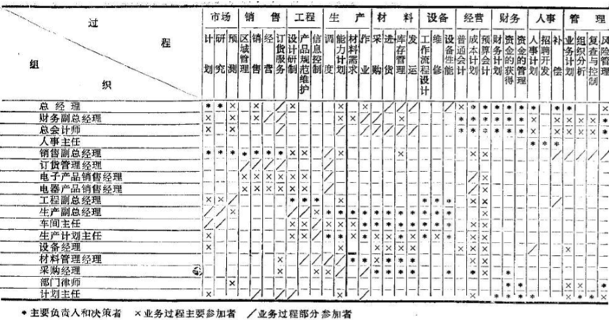
        - 上述矩阵表可用于确定进行业务过程调查的访问对象，这种访问会帮 助建立的业务过程不致有遗漏
        - 取得高层管理人员和最终用户的帮助是很重要的，只有他们才知道这 个企业是怎样真正工作的 
- 3. 业务活动
    - 在每个业务过程中都存在一定数目的业务活动 
    - 确定业务活动
        - 判断功能分解是否到底的一个有效方法，是看是否可以用一句 话来说明一个基本活动的内容和目的，如果需要几句话说明， 那么这个活动就需要继续细分
        - 从功能分解过程得出的所有基本活动的分析比较中，会发现有的活动是重 复的或者相当接近。应该清除重复活动的多余部分，合并相似的活动。 
        - 逻辑职能区域是对按企业的职能部门划分的职能区域的修正。同 样，按业务活动模型组合起来的业务过程模型是对按业务人员的经验初步 建立起来的业务过程模型的修正。 
- 4. 企业模型建立过程
    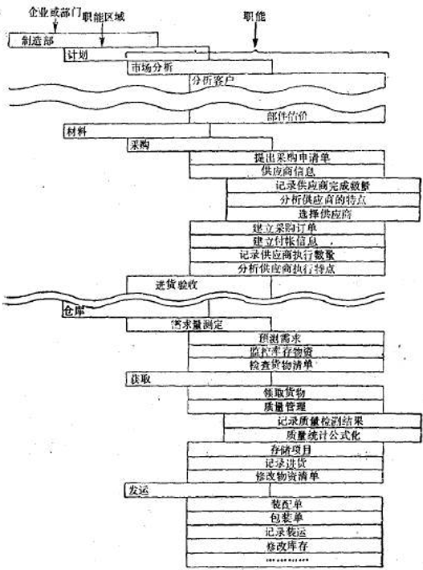

- 5. 关键成功因素
    - e.g.
        - 汽车行业
            - 燃料的节约
            - 式样
            - 髙效的销售组织
            - 生产成本的严格控制
        - 软件公司
            - 产品革新
            - 销售和用户资料的质量
            - 国际市场和服务
            - 产品的多用性

## 主题数据库

- <b>四类数据环境</b> （****************************）
    - 数据文件
    - 应用数据库
        - 为分散应用设 计分散的“数据库”
        - 仅仅是能够方便管理的数据文件而已
        - 难以数据共享
    - 主题数据库
        - 经过科学的规划与 设计，其结构与使用它的处理过程是独立的
        - 经过严格的数据分析， 建立模型需要花费时间，但其后的维护费用很低
        - 可共享
    - 信息检索系统
        - 可以多数据源
        - 目的是保证信息检索和快速査询的需要
- 数据库工程与信息工程
    - “信息工程”是规划方法论 
    - “数据库工程”是构建方法论

- 主题数据库
    - 主题数据库剖析
    - 主题数据库规划
    - 信息体系结构设计
    - 实施的优先顺序

## 实体活动分析

- 实体分析方法
    - 实体分析 + 数据模型

- 实体图结构化
    -   杂乱的实体图——“蚯蚓图”
    - 如何处理蚯蚓图
        - 找出根实体：没有单箭头连线离开的实体
            - 即第一层实体
        - 确定第二层实体：具有一个指向第一层实体的单箭头连线
        - 确定第n层实体：……
    - 绘制：第一层在最左边，第二层留一个退格，……，第n层留n-1个退格
    - 若一个非根实体具有多个上层实体，应该选择哪一个上层实体？
        - 选择联系最强的上层实体
        - 若有回路，则最弱的应断开

- 实体的组合
    - 实体图需要被划分为若干部分
        - 可被称为
            - 主题数据库
            - 数据类
            - 实体大组
        - 根据实体间联系的强弱分组。组内联系较强
        - 因此实体图中可以标上联系强弱 1-5 数字标号

- 实体与活动间的对应
    - 实体图与活动图对照

- 相关性分析与分组算法
    - 相关性定义
        - α(E1) = 使用实体 E1 的活动数目
        - α(E1, E2) = 使用实体 E1 和 E2 的活动的数目
        - E1 对 E2 的相关系数 =  α(E1, E2) / α(E1)
    - 相关系数矩阵
        - 如果 α(E11, E8) = 0.9, α(E2, E8) = 0.85，那么是否应该把E2归为E11，E8一类？
        - 计算 E2 对于 E8 和 E11 实体组的加权相关系数
        - ( E2 对 E11 的相关系数 * α(E11) + E2 对 E8 的相关系数 * α(E8) ) / ( α(E11) + α(E8))
        - 若该加权相关系数大于矩阵内其余相关系数，则应该将 E2 放入该实体组
- 主题数据库的调整
    - 相关系数本身可以代替实体联系分类中的主观分类，作 为联系的加权，可以被用来将实体图中的实体划分成为 实体大组
- 企业的改组
    - 实体和实体活动分析常常导致人们重新考虑一个公司中的职能和方法， 这项工作有时被称为职能分析 
    - 最高领导参与

## 数据分布规划
- 数据为什么需要分布 
    - 数据分布存储对于自顶向下的规划与控制，比集中式数 据库系统更为需要
- 分布式数据的六种形式（**************）
    - 复制数据（Replicated Data） 
        - 复制数据是指在不同的地点保存相同数据的几个副本
    - 子集数据（Subset Data） 
        - 子集数据是复制数据的一种形式。之所以加以区别，是因为子集数据 没有母本数据的完整模式或完整的关键字，子集数据摸式或关键字仅 是母本数据的一部分 
    - 重组织数据（Reorganized Data） 
        - 所有第四类数据系统中的数据，都可以从其它机器（甚 至是同一机器）的一些数据库（或文件）中挑选出來 
    - 分区数据（Partitioned Data） 
        - 分区数据是指相同模式被用于两台或多台计算机中，但 每台机器所存储的数据是不同的。每台计算机存有不同 的记录（主关键字的值不同），但有相同的结构 
    - 分离模式数据（Separate-Schema Data） 
        - 不同的计算机含有不同的数据和不同程序，并且通常是由不同的 开发组安装的
        - 虽然它们的模式不同，但是这些分散的数据系统必须是一个共同 的自顶向下规划的一部分，一台计算机通常需要向另一台计算机 发送数据
    - 不兼容数据（incompatible Data）
        - 有时在一些分散系统中的数据，并没有进行统一的设计 或规划。一个用户有时要从一台终端通过计算机网来存 取多个分散开发系统中的数据，这样，必须熟悉每台计 算机中的分散数据，并要了解如何存取和使用这些数据
- 数据分布的初步规划
    - 首先建立一个不考虑数据分布的总体 数据规划
        - 决定在何处分布或怎样分布的因素是很复杂的，而且有些因素 还随着时间而变化
        - 数据的战略规划需要一段不短的时间才能完成，而在这段时间 内，一些分布参数可能发生实质性的变化
- 数据分布的定性分析 
    - 如何分布是跟业务耦合的
    - 决定数据的形式
- 数据分布的定量分析 
    - 为什么分布
        - 数据和程序放到与用户活动相近的地方 （CDN）
    - 为什么集中
        - 共享数据，不需要维护多个副本修改多次
- 分布式数据规划过程
    - 好多啊不想看

## 总体数据规划方法

总体数据规划的核心是提出全企业的稳定的数据模型

# 第三部分 第六讲 信息资源管理与基础标准

## 信息资源管理概述 （*************） 霍顿 IRM 理论主要观点

IRM
- 信息资源管理的基本思想
    - 1. 信息资源（Information Resources）与人力、物力、财力 和自然资源一样，都是企业的重要资源，应该像管理其他资 源那样管理信息资源，IRM是企业管理的必要环节， IRM是 企业管理的新职能，应该纳入企业管理的预算
    - 2. 在企业的每个层面上识别信息资源和获利机会，并借以构建新的竞争优势 
    - 3. IRM追求“3E”— Efficient, Effective和Economical，即高效、实效、经济 
    - 4. IRM包括数据资源管理和信息处理管理。前者强调对数据的 控制，后者则关心企业管理人员在一定条件下如何获取和处 理信息，且强调企业中信息资源的重要性

- 信息资源管理的意义
    - 为提高企业管理绩效提供了新的思路
    - 确立了信息资源在企业中的战略地位
    - 支持企业参与市场竞争
    - 成为知识经济时代企业文化建设的重要组成部分

- 信息主管 CIO 的出现

## 信息资源管理基础标准（***************）威廉德雷尔
- 数据元素标准
    - 数据元素定义
        - 最小的不可再分的信息单位，这一类数据的总称
    - 命名标准
        - 修饰词 - 社会
        - 基本词 - 保险
        - 类别词 - 编号
- 信息分类编码标准
    - 符合规范要求
    - e.g. 条形码
- 用户视图标准 
    - 用户视图是一些数据元素的集合，它反映了最终用户对 数据实体的看法
    - 用户视图是数据在系统外部（而不是内部）的样子，是 系统的输入或输出的媒介或手段 
    - 威廉德雷尔： 用户视图与外部数据流是同义词 
    - 范式化
- 概念数据库标准 
    - 概念数据库一般用数据库名称及其内容的描述来表达
    - e.g.
        - 船舶动态： 船舶资料、预到港、锚地、作业及待离港船舶动态信息 
- 逻辑数据库标准
    - 一个逻辑数据库由一组规范化的基本表构成
    - 3-NF

## 建立和使用数据字典
    - 数据字典基本内容
        - 数据字典提供关于数据元素、元素组（记录或片断）、 记录组（文件或数据库表）信息的定义和使用机制，以 及这些数据实体之间的联系 
    - 通过数据字典进行数据管理
        
|  | 数据管理 | 数据库管理 |
|--|---------|-----------|
| 主要职责 | 管理上 | 技术上 |
| 范围 | 所有数据库 | 特定数据库 |
| 数据设计 | 逻辑的 | 物理的 |
| 主要联系人 | 管理人员 | 程序员、系统分析员 |
| 关注问题 | 长期数据规划 | 短期数据库开发与使用 |
| 主要倾向 | 元数据 数据字典 数据分析 DBMS无关性 | 数据 数据库 数据设计 特定DBMS |

    - 数据字典的使用：新系统和旧系统
    - 数据字典的设置

## 数据管理工作的展开
企业信息化的实质就是从简单地处理数据，逐步过 渡到加工数据并产生信息，最后做到把信息当成经 营资源与战略资源，全面管理与之相关的各种资源 

- 数据管理部门的职责
    - 集中控制和管理数据定义 
    - 控制元数据变化 
    - 支持数据设计专业人员的工作
    - 协调数据使用 
- 数据管理人员职务说明

- 面向数据开发方法与数据管理

- 开展数据管理工作的困难和最后的成功

### 信息工程与信息资源管理的关系

# 第三部分 第七讲 信息资源规划
- 信息资源规划方法： 为了建立集成化的企业信息系统
    - James Martin：信息工程方法论
        - 总体数据规划
            - 实体分析
            - 主题数据库的规划
    - 威廉德雷尔：信息资源管理方法论
        - 数据管理标准

- 综合两种方法论
    - 业务模型
    - 功能模型
    - 数据模型
    - 体系结构模型

    

- 任务与技术成果
    - 定义职能域、外单位
    - 职能域业务分析
    - 职能域数据分析
        - 一二级 DFD
    - 建立企业信息资源管理信息标准
        - 威廉德雷尔
    - 建立企业管理信息系统功能模
        - 基于需求分析，BPR
        - 型由逻辑子系统、功能模块、程序模块组成
    - 建立企业管理信息系统数据模
        - 基本表
        - 3NF
    - 建立企业管理信息系统体系结构模
        - CU

## 信息工程的需求分析特点
- 分析用户需求
- 启发用户需求
- 综合用户需求
- 科学表达用户需求 （文档等）

## 业务分析与业务模型建立
与 James Martin 类似
- 划分职能域
- 业务过程
- 业务活动

## 数据分析与用户视图的规范化
威廉德雷尔

## 需求分析阶段信息资源管理(IRM)基础标准的建立
威廉德雷尔

# 复习
- IRP - Infomation Resource Planning 信息资源规划
- BPR - Business Process Reengineering 业务流程重组
- ERP - Enterprise Resource Planning 企业资源规划
- BSP - Business System Planning 业务系统规划
- CRM - Customer Relationship Management 客户关系管理
- SCM - Supply Chain Management 供应链管理
- PDM - Product Data  Management 产品数据管理
- CAD - Computer Aided Design  计算机辅助设计
- BI - Business Intelligence 商务智能？
- CAPP - Computer Aided Process Planning
- CAM - Computer Aided Manufacturing
- CIMS - Computer Integrated Manufacturing
- 电子商务(e-Business)
- MRP( Material Requirement Planning) 
-  MRPII - Manufacturing Resource Planning 
- ERP (Enterprise Resources Planning)
-  SCM (Supply Chain Management) 
- 物料清单(BOM)

- 第一部分引言
    - 大智移云联万物
    - 光靠软件是不行的，还要硬件
    - 铁人三项：硬件软件，云计算，大数据
- 第二部分
    - 信息系统面临的问题
        - 信息化的本质
            - 企业的业务跟 IT 融合在一起
    - 物流业
    - 制造业
        - MPS 计算
- 第三部分
    - 信息工程方法论

- 判断题，选择题
    - 会算
- 论述题
    - 信息系统基本方法
    - James Martin  002 看书
        - 
        
    - CU 矩阵
        - 分解若干子系统

    - 威廉德雷尔信息系统理论
- 计算题
    - MPS 计算？？ 铅笔

- 四、顶层架构
- 五、James Martin
- 六、威廉德雷尔

